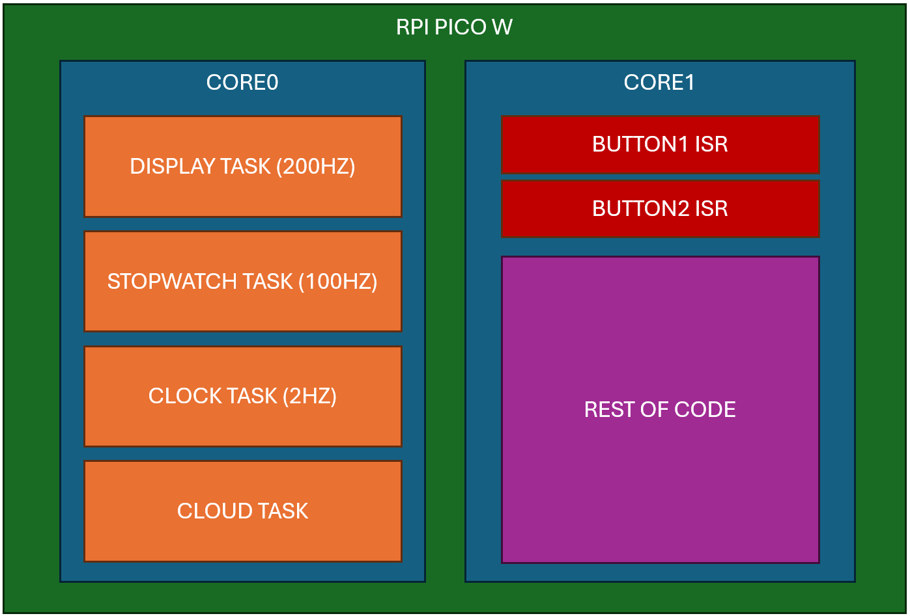
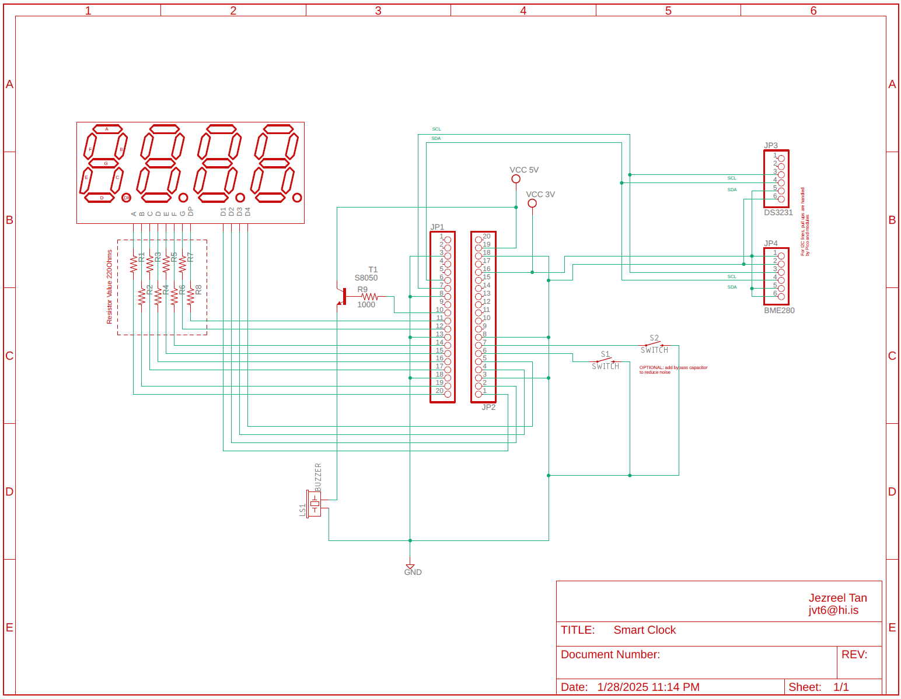

<h1 align="center">Pico SmartClock</h1>

A custom-built, real-time smart clock running on the Raspberry Pi Pico W using FreeRTOS, written in C++. Developed by Jezreel Tan.

## 📡 Live Data Dashboard

You can view the real-time data from this smart clock on ThingSpeak:

🔗 [View on ThingSpeak](https://thingspeak.mathworks.com/channels/2826263)

## 📑 Table of Contents

- [🕒 Overview](#-overview)
- [🔧 Features](#-features)
- [📁 Project Structure](#-project-structure)
- [🚀 How It Works](#-how-it-works)
  - [Design Pattern](#design-pattern)
- [🔨 Build Instructions](#-build-instructions)
  - [Prerequisites](#prerequisites)
  - [Build Steps](#build-steps)
- [🔌 Flashing to Pico](#-flashing-to-pico)
- [📚 Dependencies](#-dependencies)
- [🔲 Block Diagram](#-block-diagram)
- [📐 Schematic Diagram](#-schematic-diagram)
- [📄 License](#-license)
- [👤 Author](#-author)

## 🕒 Overview

<p align="justify">The <b>Pico SmartClock</b> is a lightweight embedded system designed for accurate real-time clock functionality on the Raspberry Pi Pico W. It is implemented with multithreading using **FreeRTOS** and includes modular support for I2C and PWM peripherals. This project showcases how a clean architecture can drive real-time behavior on a constrained embedded platform.</p>

## 🔧 Features

- Real-time clock control with modular system component architecture
- Dual-core execution using `multicore_launch_core1` for RTOS tasks
- FreeRTOS kernel integration with a custom CMake setup
- USB-based debugging with `stdio_usb` enabled
- Expandable component system via the `SystemComponents` class

## 📁 Project Structure
```
Pico_SmartClock/
├── Pico_SmartClock.cpp         # Main application entry point
├── CMakeLists.txt              # Build configuration using CMake
├── pico_sdk_import.cmake       # Imports the Pico SDK
├── bin/
│   └── FreeRTOS-Kernel/        # FreeRTOS kernel files
├── setup.hpp                   # System configuration and class declarations
└── .git/                       # Git repository metadata
```

## 🚀 How It Works
Main Application Logic (simplified)
```
int main() {
    stdio_init_all();                             // Initialize standard IO
    Smart_Clock.Initialize();                     // Set up clock components
    multicore_launch_core1(core1_rtos_process);   // Launch RTOS on core 1
    Smart_Clock.Run();                            // Main loop
    return 0;
}

void core1_rtos_process() {
    Smart_Clock.RunRTOS();                        // Execute RTOS tasks on the second core
}
```

### Design Pattern
- SystemComponents handles I2C, PWM, and other hardware control.
- SYSTEM_class instance (Smart_Clock) manages scheduling and operations.
- Easily extendable by attaching new peripheral objects via components list.

## 🔨 Build Instructions
### Prerequisites
- Raspberry Pi Pico SDK
- CMake >= 3.13
- ARM GCC Toolchain (arm-none-eabi-gcc)
- Python 3 and Git

### Build Steps
```
# Clone the repository
git clone https://github.com/yourusername/Pico_SmartClock.git
cd Pico_SmartClock

# Initialize submodules (for FreeRTOS etc.)
git submodule update --init --recursive

# Create build directory
mkdir build && cd build

# Run CMake configuration
cmake ..

# Compile the firmware
make
```
>⚠️ Make sure PICO_SDK_PATH is correctly exported in your shell or set via CMake GUI.

## 🔌 Flashing to Pico
1. Press and hold the BOOTSEL button on your Pico.
2. Connect it to your PC via USB.
3. Drag and drop the generated .uf2 file (inside /build) to the RPI-RP2 drive.

## 📚 Dependencies
- Raspberry Pi Pico SDK
- FreeRTOS Kernel
- Pico libraries for hardware_pwm, hardware_i2c, and pico_multicore
- Optional: pico_cyw43_arch_lwip_poll for WiFi support

## 🔲 Block Diagram

  
## 📐 Schematic Diagram


## 📄 License
MIT License.

## 👤 Author
Jezreel Tan
📧 jvt6@hi.is

> This project was created for embedded systems exploration and real-time application demos on low-power microcontrollers.
